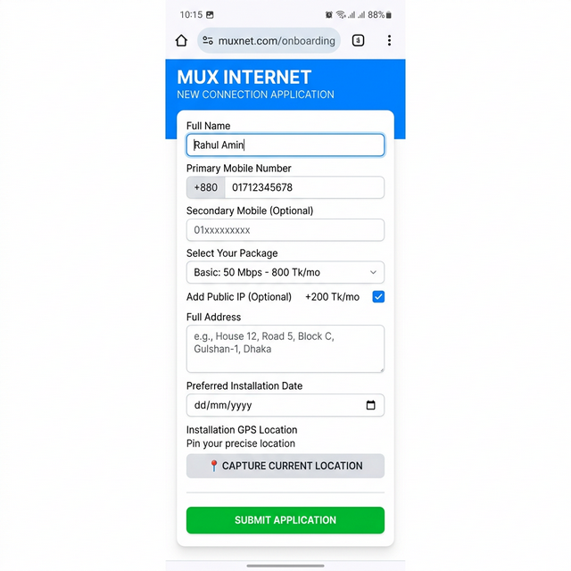
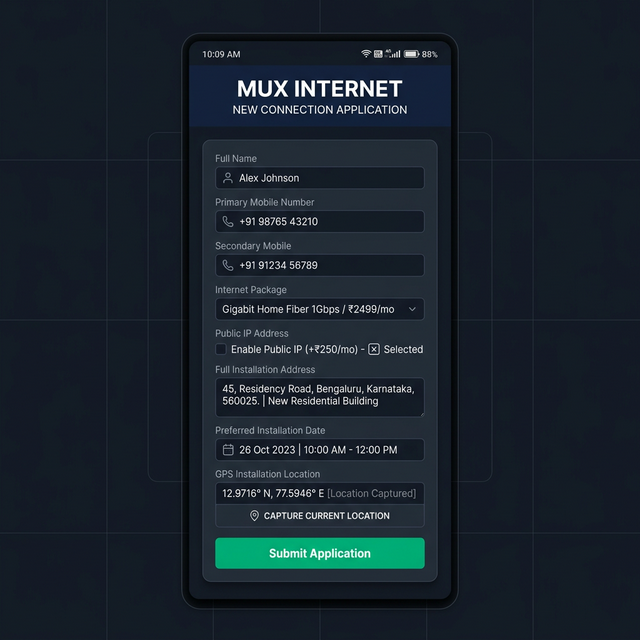
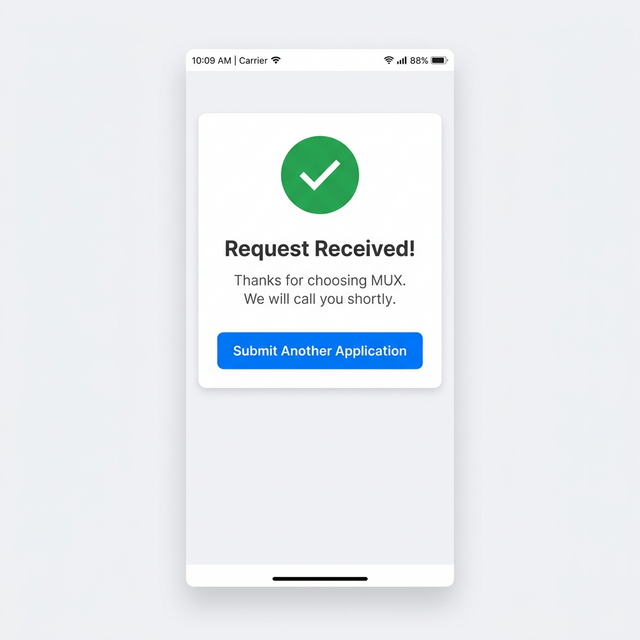

<div align="center">
  

  # 📋 SmartForm — ISP Customer Onboarding

  **A GPS-enabled customer onboarding form for Internet Service Providers, built on Google Apps Script.**

  [](https://script.google.com)
  [](https://tailwindcss.com)
  [](LICENSE)

  [Features](#-features) · [Quick Start](#-quick-start) · [Customization](#-customization) · [Architecture](#-architecture)

</div>

---

## ✨ Features

| Feature | Description |
|---------|-------------|
| 📍 **Smart GPS Tracking** | Two-phase location capture with silent background refinement for optimal accuracy |
| 🔐 **Permission-Aware** | Auto-detects GPS permission state — never shows intrusive popups on first visit |
| 📱 **Mobile-First Design** | Responsive UI built with Tailwind CSS, optimized for field agents on phones |
| 🌙 **Auto Dark Mode** | Follows system dark/light preference automatically — zero config |
| 📊 **Google Sheets Integration** | Every submission saved to a spreadsheet with timestamp, GPS, and map link |
| 🔔 **Instant Notifications** | Webhook integration (Make.com / Zapier) for real-time alerts (e.g., Telegram) |
| ✅ **BD Mobile Validation** | Pattern-validated 11-digit Bangladesh mobile numbers (01x format) |
| 🔄 **Multi-Submit** | "Submit Another" button resets the form instantly without page reload |
| 🛡️ **Resilient Backend** | Webhook failures don't affect form submission — data is always saved first |

## 📸 Screenshots

<div align="center">
<table>
<tr>
<td align="center"><b>☀️ Light Mode</b></td>
<td align="center"><b>🌙 Dark Mode</b></td>
<td align="center"><b>✅ Success</b></td>
</tr>
<tr>
<td></td>
<td></td>
<td></td>
</tr>
</table>
</div>

## 🚀 Quick Start

### 1. Create a Google Sheet

Create a new [Google Sheet](https://sheets.new) with these column headers in Row 1:

| A | B | C | D | E | F | G | H |
|---|---|---|---|---|---|---|---|
| Timestamp | Name | Mobile | Address | Installation Date | Map Link | GPS Data | Package |

Copy the Sheet URL — you'll need it in step 3.

### 2. Set Up Google Apps Script

1. Go to [Google Apps Script](https://script.google.com) → **New Project**
2. Delete the default code in `Code.gs` and paste the contents of [`code.gs`](code.gs)
3. Click **+** next to Files → **HTML** → name it `Index` (not `Index.html`, Apps Script adds the extension)
4. Paste the contents of [`index.html`](index.html) into the `Index.html` file

### 3. Configure

In `code.gs`, replace the placeholder values:

```javascript
var WEBHOOK_URL = "YOUR_WEBHOOK_URL_HERE";  // Your Make.com or Zapier webhook
var SHEET_URL = "YOUR_GOOGLE_SHEET_URL_HERE"; // Your Google Sheet URL
```

### 4. Deploy

1. Click **Deploy** → **New deployment**
2. Select type: **Web app**
3. Set:
   - **Execute as**: Me
   - **Who has access**: Anyone
4. Click **Deploy** and authorize when prompted
5. Copy the **Web app URL** — this is your form link! 📎

### 5. (Optional) Set Up Webhook Notifications

Connect a webhook service to receive instant notifications on each submission:

<details>
<summary><b>Make.com → Telegram</b></summary>

1. Create a new scenario on [Make.com](https://make.com)
2. Add a **Webhooks** → **Custom webhook** trigger
3. Copy the webhook URL into `code.gs`
4. Add a **Telegram Bot** → **Send a Message** action
5. Map the fields: `name`, `mobile`, `package`, `address`, `date`, `map`, `accuracy`

</details>

<details>
<summary><b>Zapier → Email/Slack/Discord</b></summary>

1. Create a new Zap on [Zapier](https://zapier.com)
2. Trigger: **Webhooks by Zapier** → **Catch Hook**
3. Copy the webhook URL into `code.gs`
4. Action: Choose your notification channel (Email, Slack, Discord, etc.)

</details>

## 🎨 Customization

### Change Company Branding

Edit these lines in `index.html`:

```html
<h1 class="text-2xl font-bold uppercase tracking-wider">YOUR COMPANY NAME</h1>
<p class="text-blue-100 text-xs mt-1 uppercase font-semibold">New Connection Application</p>
```

And in `code.gs`:

```javascript
.setTitle('Your Company Name')
```

### Change Packages

Edit the `<select>` options in `index.html`:

```html
<option>Basic: 50 Mbps - 800 Tk/mo</option>
<option>Advance: 100 Mbps - 1,000 Tk/mo</option>
<!-- Add or remove options as needed -->
```

### Change Mobile Validation

The default pattern validates Bangladesh numbers (`01[3-9]xxxxxxxxx`). To change for your country:

```html
<!-- Example: US format (10 digits) -->
<input type="tel" pattern="[0-9]{10}" maxlength="10" placeholder="1234567890">
```

### Disable Dark Mode

Remove the `@media (prefers-color-scheme: dark) { ... }` block from the `<style>` section.

## 🏗️ Architecture

```
SmartForm
├── code.gs              # Server-side: Sheet saving + webhook notifications
├── index.html           # Client-side: Form UI + GPS logic + dark mode
├── banner.png           # Project banner for README
├── screenshots/         # UI screenshots
│   ├── light-mode.png
│   ├── dark-mode.png
│   └── success-screen.png
├── README.md
├── LICENSE
└── .gitignore
```

### GPS Flow

```
Page Load
    │
    ├── Permission already granted? → Auto-start GPS silently
    ├── Permission not yet asked?   → Wait for button press
    └── Permission denied?          → Show inline help message
    
Button Press / Auto-start
    │
    ├── Phase 1: getCurrentPosition() → Instant lock (1-5 sec)
    │   └── UI shows "✅ Location Locked!"
    │
    └── Phase 2: watchPosition() → Silent refinement (up to 10 sec)
        └── Coordinates improve invisibly in background
```

### Data Flow

```
User fills form → Submit
    │
    ├── 1. Save to Google Sheet ✅ (always succeeds first)
    │
    └── 2. Send webhook notification 🔔 (try-catch, non-blocking)
        └── If webhook fails → logged, user still sees success
```

## 📱 Sheet Columns Reference

| Column | Example Value |
|--------|--------------|
| **Timestamp** | `2/27/2026 5:30:00 PM` |
| **Name** | `John Doe` |
| **Mobile** | `'01712345678 / 01812345678` |
| **Address** | `Flat 3A, 5th Floor, Building 12, Road 7, Block C` |
| **Installation Date** | `2026-03-01` |
| **Map Link** | `https://maps.google.com/maps?q=22.3569,91.7832` |
| **GPS Data** | `22.3569,91.7832 (Acc: 12m)` |
| **Package** | `Advance: 100 Mbps - 1,000 Tk/mo + Public IP 200tk/mo` |

## 🤝 Contributing

Contributions are welcome! Feel free to:

- 🐛 Report bugs via [Issues](../../issues)
- 💡 Suggest features
- 🔀 Submit pull requests

## 📄 License

This project is licensed under the [MIT License](LICENSE).

---

<div align="center">
  <sub>Built with ❤️ for ISPs who need a fast, reliable customer onboarding form.</sub>
</div>
